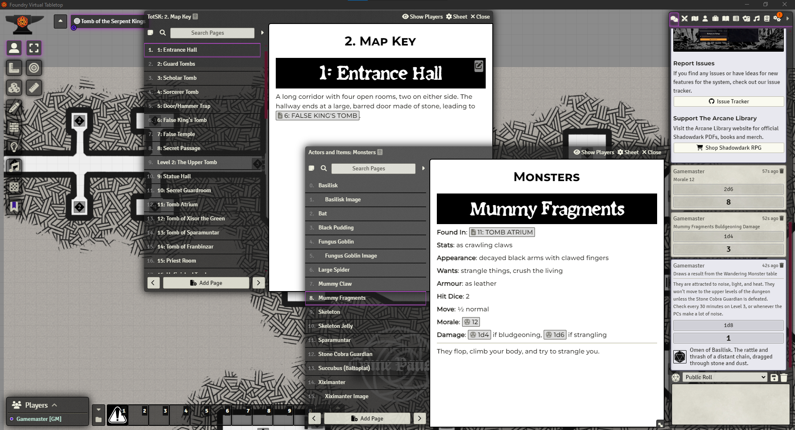
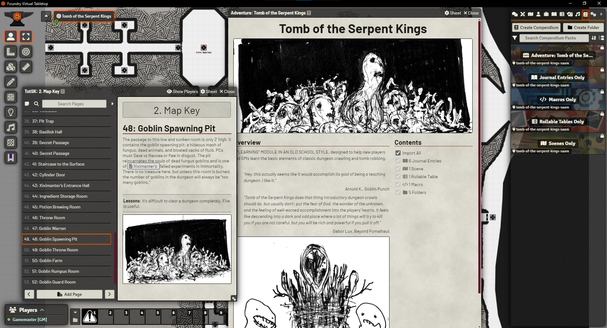
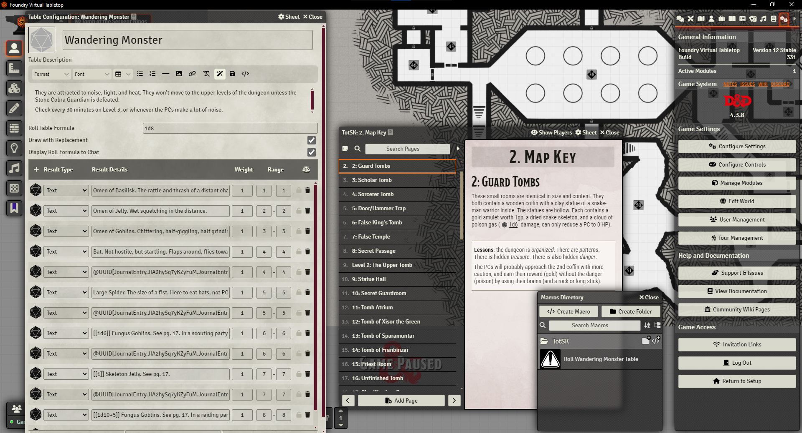

# Tomb of the Serpent Kings (SAAM) Foundry VTT Module

## How to install

* Search for the module in Foundry's *Add-on modules* tab.
* Install manually with this manifest url: https://github.com/abacus-tabletop-games/tomb-of-the-serpent-kings-saam/releases/latest/download/module.json

This is the famed "learning" module in an old school style. 

It is released as a System-Agnostic Adventure Module (SAAM). This does not mean that the adventure itself is written to be played with any ruleset, only that it is built to be usable with any Foundry game system. This is a dream of mine: adventure modules being made without being locked to a specific system. I hope it will catch on, so that GMs can have access to lots of ready-to-play adventures while still retaining their ability to use the system they prefer.

SAAM is a dream of mine. I hope it will catch on, so that GMs can have access to lots of ready-to-play adventures while still retaining their ability to use the system they prefer and for which they may already have bought compendia.

It makes this module less dependent on software in the same way a PDF or a hard copy is: all the tools you already have can be used to play the adventure. The downside is that there are no Actors and no Items provided in this module, since those are not system-agnostic. You need to use the ones provided by your game system (or create your own). To mitigate this, I made sure to take the most out of Journal Entries. The GM willing to put a bit of effort creating Actors and Items for their system of choice will know exactly what they need to create. The ones that just want to play right away will be able to roll straight from the Journal entries themselves: mechanics described in the adventure are rollable, and rolls are described in the chat card.

I'm sure the community will have plenty of great ideas to make this module (and all SAAMs) even better. I can't wait to hear what you have to say. 

*Tomb of the Serpent Kings* is the perfect candidate to start the whole SAAM idea. It's an old-school module meant to teach anyone how to play, whatever their ruleset of choice. It is shared under a CC-BY-NC-SA license, meaning it's free to use, reuse and adapt as long as the result remains free, too (and attribution given). It is also widely shared as a great way to start playing in an old-school way. Hopefully, this module will make it almost as easy to do so using Foundry as it is using a physical tabletop. People coming from 5e and willing to try something different won't even need to use a different Foundry game system!

Thank you for checking it out, and happy gaming!

Thank you!

Jordan — [Abacus Tabletop Games](https://abacustabletopgames.bearblog.dev/)

## Dependencies

None. 

## Attributions and Thanks

* Macro icon by Lorc, CC-BY-3.0 https://game-icons.net/1x1/lorc/hazard-sign.html
* Tomb of the Serpent Kings written by Skerples, Art by Scrap Princess, Map by Janon (not in this Foundry module) and layout by David Shigars. CC-BY-NC-SA. https://coinsandscrolls.blogspot.com/2017/06/osr-tomb-of-serpent-kings-megapost.html
* Map drawn by me, Jordan Raymond, using Dungeondraft and Blueprint Assets by DnDungeon, used under the full version license. [blueprints.dndmaps.net](https://blueprints.dndmaps.net/). 
* Numbered map pins icons created by using Automatic Journal Icon Numbers, by ChrisF. With permission by the module author. https://foundryvtt.com/packages/journal-icon-numbers
* Screenshots made in the Fantastic Depths Game System, Shadowdark Game System and D&D 5e Game System. I did not ask permission, though! https://foundryvtt.com/packages/fantastic-depths, https://foundryvtt.com/packages/shadowdark and https://foundryvtt.com/packages/dnd5e 

You can find my stuff on my [website](https://abacustabletopgames.bearblog.dev/). If you just want to [pay me a coffee](https://ko-fi.com/abacus_tabletop_games), I thank you!

